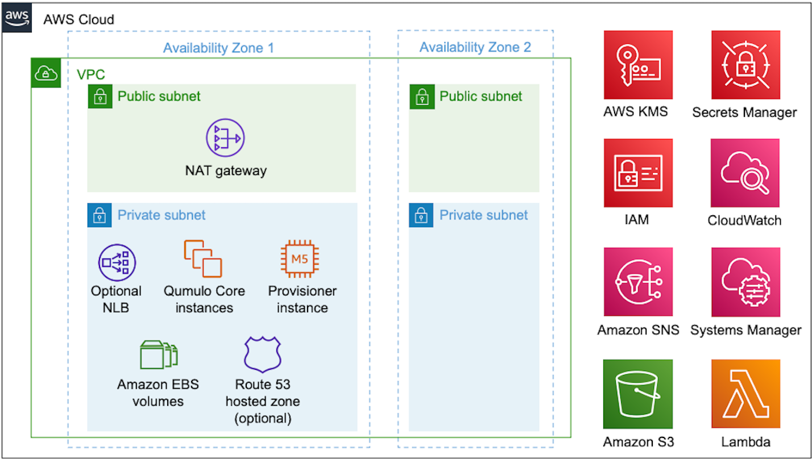

<!-- BEGIN_TF_DOCS -->

[](http://qumulo.com)

# aws-terraform-cloud-q [](https://github.com/qumulo/aws-terraform-cloud-q/releases) 

Comprehensive Terraform to deploy a Qumulo cluster with 4 to 20 instances per the AWS Well Architected Framework.
Supports usable capacities from 1TB to 6PB with all Qumulo Core features.

## AWS Requirements

This Terraform deploys Qumulo AMIs with [Qumulo Core Cloud Software](https://qumulo.com/product/cloud-products/) version `>= 5.1.0.1`

A subscription to a Qumulo offer in [AWS Marketplace](https://aws.amazon.com/marketplace/search/results?x=0&y=0&searchTerms=qumulo) is required.
For private offers via the AWS Marketplace contact [Qumulo Sales](http://discover.qumulo.com/cloud-calc-contact.html).

## Planning the Deployment

Reference Architecture:


For help planning the deployment see the table of documents below.

| Documentation                                                                                                    | Description                                                                                          |
| ---------------------------------------------------------------------------------------------------------------- | ---------------------------------------------------------------------------------------------------- |
| [DNS options in AWS: IP failover & client distribution](https://qumulo.com/resources/qumulo-dns-options-in-aws/) | Details on the DNS options in AWS.                                                                   |
| [Terraform: Supported AWS Regions](./docs/tf-supported-regions.pdf)                                              | Details on supported AWS Regions for Cloud Q with Terraform.                                         |
| [Terraform: Deploying in a VPC with no outbound internet access](./docs/tf-deploying-without-inet.pdf)           | Details on deploying with Terraform into a VPC that has no outbound internet access.                 |
| [Terraform: Deploying using an AWS Custom IAM role](./docs/tf-deploying-with-custom-iam-role.pdf)                | Details on deploying with Terraform using a custom IAM role.                                         |
| [Terraform: AWS resources & EBS Service Quota planning](./docs/tf-resources-ebs-quota-planning.pdf)              | Details on service-quota planning for Amazon EBS, including EC2 instance types and EBS volume types. |
| [Terraform: Qumulo sizing & performance on AWS](./docs/tf-qumulo-sizing-performance.pdf)                         | Details on Qumulo cluster performance and scalability on AWS.                                        |
| [Terraform: Qumulo distributed multi-AZ deployment on AWS](./docs/tf-qumulo-multi-az-deployment.pdf)             | Details on deploying a distributed multi-AZ cluster on AWS.                                          |

## Deploying with Terraform

### Deployment Considerations

- You may deploy this as a module pinned to this repo or clone this repo and deploy in your local Terraform environment as a module or directly.
- Pinning Example: git::https://github.com/Qumulo/aws-terraform-cloud-q.git?ref=v3.3
- Cloning Example: git clone https://github.com/Qumulo/aws-terraform-cloud-q.git --branch v3.3 --single-branch
  <br />

**IMPORTANT:** When pinning or cloning this repository specify the tagged release version because there may be breaking changes between releases. If you want the latest, reference 'main' realizing there may be breaking changes for your deployment.

### Terraform Naming Guidance

There are a multitude of Terraform workflows from those that just use a default local workspace to those using Terraform Cloud with remote state. The very first variable in the example files provided is **deployment_name**. Some users may choose to make this the workspace name. Other users may want the same deployment name in multiple workspaces. Regardless, a **deployment_unique_name** is generated that consists of the deployment name appended with an 11 digit random alphanumeric. All resources are tagged with the **deployment_unique_name**. The **deployment_unique_name** will never change on subsequent Terraform applies. All subsequent changes to **deployment_name** are ingored. No matter your naming convention or how you choose to use Terraform, you will have your chosen name and uniquely named resources so no conflicts occur between NLBs, resource groups, cross-regional CloudWatch views, etc.
<br />

**IMPORTANT:** If you are spinning up multiple clusters, define unique values for the **q_cluster_name** variable. If using the optional Route53 PHZ, also define a unique value for **q_fqdn_name** for each cluster.

### Inputs Comparison

Select between the minimalist **examples/standard.tf** or the fully featured **examples/advanced.tf**. The file **terraform.tfvars** is a copy of the input values from **examples/advanced.tf** in this repository. These files all have extensive comments providing guidance on each variable. The standard version makes many decisions for you to simplify the input process and deploy a Qumulo cluster with the software version of the Qumulo AMI. The advanced version provides the flexibility that most production environments will require, as seen in the table below.

|                                                 | examples/standard.tf | examples/advanced.tf |
| ----------------------------------------------- | :------------------: | :------------------: |
| Deploy in a Local Zone                          |                      |          ✅          |
| Deploy on Outposts                              |                      |          ✅          |
| Deploy with a Custom AMI-ID                     |                      |          ✅          |
| Deploy a distributed multi-AZ cluster           |                      |          ✅          |
| Customize Qumulo Admin Password                 |          ✅          |          ✅          |
| Customize EC2 Instance Type                     |          ✅          |          ✅          |
| Customize EC2 Instance Count                    |          ✅          |          ✅          |
| Customize Termination Protection                |          ✅          |          ✅          |
| Customize EBS gp3 IOPS/Throughput               |                      |          ✅          |
| Customize Qumulo Cluster Name                   |                      |          ✅          |
| Customize Qumulo Software Version               |                      |          ✅          |
| Customize Qumulo Sidecar Deployment             |                      |          ✅          |
| Customize Qumulo # of Floating IPs              |                      |          ✅          |
| Optional: Add SNS Topics for EC2 & EBS Recovery |                      |          ✅          |
| Optional: Add R53 PHZ DNS for Floating IPs      |                      |          ✅          |
| Optional: Add CIDRS to Qumulo Security Group    |                      |          ✅          |
| Optional: Add SG IDs to Qumulo Cluster          |                      |          ✅          |
| Optional: Deploy with an NLB                    |                      |          ✅          |
| Optional: Add Qumulo Public Management          |                      |          ✅          |
| Optional: Add Qumulo Public Replication Port    |                      |          ✅          |
| Optional: Enable CloudWatch Audit Log Messages  |                      |          ✅          |
| Optional: Apply KMS CMK for EBS Encryption      |                      |          ✅          |
| Optional: Set IAM Permissions Boundary          |                      |          ✅          |
| Optional: Set Environment Type                  |                      |          ✅          |

---

### Standard Deployment Example

```hcl
module "qumulo_cloud_q" {
  source = "git::https://github.com/Qumulo/aws-terraform-cloud-q.git?ref=v4.6"

  # ****************************** Required *************************************************************
  # ***** Terraform Variables *****
  # deployment_name                   - Any <=32 character name for the deployment. Set on first apply.  Changes are ignored after that to prevent unintended resource destruction.
  #                                   - All infrastructure will be tagged with the Deployment Name and a unique 11 digit alphanumeric suffix.
  deployment_name = "my-deployment-name"
  # ***** S3 Bucket Variables *****
  # s3_bucket_name                    - Preconfigured S3 Bucket to place provisioning instance files in
  # s3_bucket_prefix                  - Preconfigured S3 prefix, a folder. A subfolder with the deployment name is created under the supplied prefix
  # s3_bucket_region                  - Region the S3 bucket is preconfigured in
  s3_bucket_name   = "my-bucket"
  s3_bucket_prefix = "my-prefix/"
  s3_bucket_region = "us-west-2"
  # ***** AWS Variables *****
  # aws_region                        - Region for the deployment of the cluster
  # aws_vpc_id                        - The VPC for the deployment within the provided region
  # ec2_keypair                       - EC2 key pair within the region
  # private_subnet_id                 - Private Subnet to deploy the cluster in
  # term_protection                   - true/false to enable termination protection for EC2 and/or nlb-qumulo .  This should be set to 'true' for production deployments.
  aws_region        = "us-west-2"
  aws_vpc_id        = "vpc-1234567890abcdefg"
  ec2_key_pair      = "my-keypair"
  private_subnet_id = "subnet-1234567890abcdefg"
  term_protection   = true
  # ***** Qumulo Cluster Variables *****
  # q_cluster_admin_password          - Minumum 8 characters and must include one each of: uppercase, lowercase, and a special character
  # q_instance_type                   - >= m5.2xlarge, >= m6i.2xlarge, or >= c5n.4xlarge. To use m5.xlarge set the optional variable dev_environment=true
  # q_marketplace_type                - The type of AWS Marketplace offer accepted.  Values are:
  #                                       1TB-Usable-All-Flash or 103TB-Usable-All-Flash
  #                                       12TB-Usable-Hybrid-st1, 96TB-Usable-Hybrid-st1, 270TB-Usable-Hybrid-st1, or 809TB-Usable-Hybrid-st1
  #                                       Custom-1TB-6PB or Specified-AMI-ID
  q_cluster_admin_password = "!MyPwd123"
  q_instance_type          = "m5.2xlarge"
  q_marketplace_type       = "1TB-Usable-All-Flash"
  # ***** Qumulo Sidecar Variables *****
  # q_sidecar_version                 - The software verison for the sidecar must match the cluster.  This variable can be used to update the sidecar software version post deployment.
  q_sidecar_version           = "5.1.0.1"
  # ****************************** Marketplace Type Selection Dependencies ******************************
  # ***** Qumulo Cluster Config Options *****
  # q_disk_config                     - Specify the disk config only if using Marketplace types of 'Custom-' or 'Specified-AMI-ID'  Valid disk configs are:
  #                                       600GiB-AF, 1TB-AF, 5TB-AF, 8TiB-AF, 13TiB-AF, 20TiB-AF, 30TB-AF, 35TiB-AF, 55TiB-AF
  #                                       5TB-Hybrid-st1, 8TiB-Hybrid-st1, 13TiB-Hybrid-st1, 20TB-Hybrid-st1, 35TiB-Hybrid-st1, 55TiB-Hybrid-st1, 90TiB-Hybrid-st1, 160TiB-Hybrid-st1, 256TiB-Hybrid-st1, 320TiB-Hybrid-st1
  #                                       8TiB-Hybrid-sc1, 13TiB-Hybrid-sc1, 20TB-Hybrid-sc1, 35TiB-Hybrid-sc1, 55TiB-Hybrid-sc1, 90TiB-Hybrid-sc1, 160TiB-Hybrid-sc1, 256TiB-Hybrid-sc1, 320TiB-Hybrid-sc1
  # q_node_count                      - Total # of EC2 Instances in the cluster (4-20).  Specify if growing the cluster or using Marketplace types of 'Custom-' or 'Specified-AMI-ID'. 0 implies marketplace config lookup.
  q_disk_config  = null
  q_node_count   = 0
  # ****************************** Optional **************************************************************
  # ***** Environment and Tag Options *****
  # tags                              - Additional tags to add to all created resources.  Often used for billing, departmental tracking, chargeback, etc.
  #                                     If you add an additional tag with the key 'Name' it will be ignored.  All infrastructure is tagged with the 'Name=deployment_unique_name'.
  #                                        Example: tags = { "key1" = "value1", "key2" = "value2" }
  tags            = null
}

output "outputs_qumulo_cloud_q" {
  value = module.qumulo_cloud_q
}
```

### Advanced Deployment Example

```hcl
module "qumulo_cloud_q" {
  source = "git::https://github.com/Qumulo/aws-terraform-cloud-q.git?ref=v4.6"

  # ****************************** Required *************************************************************
  # ***** Terraform Variables *****
  # deployment_name                   - Any <=32 character name for the deployment. Set on first apply.  Changes are ignored after that to prevent unintended resource destruction.
  #                                   - All infrastructure will be tagged with the Deployment Name and a unique 11 digit alphanumeric suffix.
  deployment_name = "my-deployment-name"
  # ***** S3 Bucket Variables *****
  # s3_bucket_name                    - Preconfigured S3 Bucket to place provisioning instance files in
  # s3_bucket_prefix                  - Preconfigured S3 prefix, a folder. A subfolder with the deployment name is created under the supplied prefix
  # s3_bucket_region                  - Region the S3 bucket is preconfigured in
  s3_bucket_name   = "my-bucket"
  s3_bucket_prefix = "my-prefix/"
  s3_bucket_region = "us-west-2"
  # ***** AWS Variables *****
  # aws_region                        - Region for the deployment of the cluster
  # aws_vpc_id                        - The VPC for the deployment within the provided region
  # ec2_keypair                       - EC2 key pair within the region
  # private_subnet_id                 - Private Subnet to deploy the cluster in, or a comma delimited list with four subnets if deploying a multi-AZ distributed cluster
  #                                       Note: Distributed multi-AZ deployments are only supported in regions with at least 4 AZs: us-west-2, us-east-1, and ap-northeast-2.
  # term_protection                   - true/false to enable termination protection for EC2 and/or nlb-qumulo .  This should be set to 'true' for production deployments.
  aws_region        = "us-west-2"
  aws_vpc_id        = "vpc-1234567890abcdefg"
  ec2_key_pair      = "my-keypair"
  private_subnet_id = "subnet-1234567890abcdefg"
  term_protection   = true
  # ***** Qumulo Cluster Variables *****
  # q_cluster_admin_password          - Minumum 8 characters and must include one each of: uppercase, lowercase, and a special character
  # q_cluster_name                    - Name must be an alpha-numeric string between 2 and 15 characters. Dash (-) is allowed if not the first or last character. Must be unique per cluster.
  # q_cluster_version                 - Software version for creation >= 5.1.0.1.  This variable MAY NOT BE USED to update the cluster software after creation.  Use the Qumulo UI instead.
  # q_instance_type                   - >= m5.2xlarge, >= m6i.2xlarge, or >= c5n.4xlarge. To use m5.xlarge set the optional variable dev_environment=true
  # q_marketplace_type                - The type of AWS Marketplace offer accepted.  Values are:
  #                                       1TB-Usable-All-Flash or 103TB-Usable-All-Flash
  #                                       12TB-Usable-Hybrid-st1, 96TB-Usable-Hybrid-st1, 270TB-Usable-Hybrid-st1, or 809TB-Usable-Hybrid-st1
  #                                       Custom-1TB-6PB or Specified-AMI-ID
  q_cluster_admin_password = "!MyPwd123"
  q_cluster_name           = "Cloud-Q"
  q_cluster_version        = "5.3.1"
  q_instance_type          = "m5.2xlarge"
  q_marketplace_type       = "1TB-Usable-All-Flash"
  # ***** Qumulo Sidecar Variables *****
  # q_local_zone_or_outposts          - true if deploying the cluster in a local zone or on Outposts.
  # q_sidecar_private_subnet_id       - Subnet in the Parent Region for the Sidecar Lambdas if deploying in a local zone or on Outposts.
  # q_sidecar_provision               - true to deploy the Sidecar Lambdas.
  # q_sidecar_version                 - The software verison for the sidecar must match the cluster.  This variable can be used to update the sidecar software version post deployment.
  q_local_zone_or_outposts    = false
  q_sidecar_private_subnet_id = null
  q_sidecar_provision         = true
  q_sidecar_version           = "5.3.1"
  # ****************************** Marketplace Type Selection Dependencies ******************************
  # ***** Qumulo Cluster Config Options *****
  # q_ami_id                          - This ami-id is only used if 'q_marketplace_type' is set to 'Specified-AMI-ID' above
  # q_disk_config                     - Specify the disk config only if using Marketplace types of 'Custom-' or 'Specified-AMI-ID'  Valid disk configs are:
  #                                       600GiB-AF, 1TB-AF, 5TB-AF, 8TiB-AF, 13TiB-AF, 20TiB-AF, 30TB-AF, 35TiB-AF, 55TiB-AF
  #                                       5TB-Hybrid-st1, 8TiB-Hybrid-st1, 13TiB-Hybrid-st1, 20TB-Hybrid-st1, 35TiB-Hybrid-st1, 55TiB-Hybrid-st1, 90TiB-Hybrid-st1, 160TiB-Hybrid-st1, 256TiB-Hybrid-st1, 320TiB-Hybrid-st1
  #                                       8TiB-Hybrid-sc1, 13TiB-Hybrid-sc1, 20TB-Hybrid-sc1, 35TiB-Hybrid-sc1, 55TiB-Hybrid-sc1, 90TiB-Hybrid-sc1, 160TiB-Hybrid-sc1, 256TiB-Hybrid-sc1, 320TiB-Hybrid-sc1
  # q_flash_type                      - Specify gp2 or gp3.  Default is gp3.
  # q_flash_tput                      - Specify gp3 throughput in MB/s 125 to 1000. Default is 250.  Not applicable to gp2.
  # q_flash_iops                      - Specify gp3 iops between 3000 to 16000.  Default is 3000.  Not applicable to gp2.
  # q_node_count                      - Single AZ only & ignored for multi-AZ.  Total # of EC2 Instances in the cluster (4-20).  Specify if growing the cluster or using Marketplace types of 'Custom-' or 'Specified-AMI-ID'. 0 implies marketplace config lookup.
  # q_nodes_per_az                    - Multi AZ only & ignored for single AZ.  Must be specified for distributed multi-AZ deployments with 1, 2, or 3.
  q_ami_id       = null
  q_disk_config  = null
  q_flash_type   = "gp3"
  q_flash_tput   = 250
  q_flash_iops   = 3000
  q_node_count   = 0
  q_nodes_per_az = 0
  # ****************************** Optional **************************************************************
  # ***** Environment and Tag Options *****
  # dev_environment                   - Set to true to enable the use of m5.xlarge instance types.  NOT recommended for production.
  # tags                              - Additional tags to add to all created resources.  Often used for billing, departmental tracking, chargeback, etc.
  #                                     If you add an additional tag with the key 'Name' it will be ignored.  All infrastructure is tagged with the 'Name=deployment_unique_name'.
  #                                        Example: tags = { "key1" = "value1", "key2" = "value2" }
  dev_environment = false
  tags            = null
  # ***** Qumulo Cluster Misc Options *****
  # kms_key_id                        - Specify a KMS Customer Managed Key ID for EBS Volume Encryption. Otherwise an AWS default EBS KMS key will be used.
  # q_audit_logging                   - Set true to enable audit logging to CloudWatch logs
  # q_cluster_additional_sg_cidrs     - Comma delimited list of CIDRS to add to the Qumulo Cluster security group. 10.10.10.0/24, 10.11.30.0/24, etc
  # q_cluster_additional_sg_ids       - Comma delimited list of optional security group Ids to add to the Qumulo Cluster. sg-0123456789abcdefg, sg-abcdefg0123456789, etc
  # q_floating_ips_per_node           - An integer value from 1 to 4 for IP failover protection and client distribution with DNS. Set to 0 if deploying nlb-qumulo module.
  # q_permissions_boundary            - Apply an IAM permission boundary policy to all created IAM roles. Policy Name not ARN.
  kms_key_id                    = null
  q_audit_logging               = false
  q_cluster_additional_sg_cidrs = null
  q_cluster_additional_sg_ids   = null
  q_floating_ips_per_node       = 3
  q_permissions_boundary        = null
  # ***** OPTIONAL SNS Options *****
  # q_instance_recovery_topic         - Specify the SNS arn to notify during instance recovery events
  # q_sidecar_ebs_replacement_topic   - Specify the SNS arn to notify when sidecar replaces a failed EBS volume
  q_instance_recovery_topic       = null
  q_sidecar_ebs_replacement_topic = null
  # ***** OPTIONAL module 'rout53-phz' *****
  # q_fqdn_name                       - Specify an FQDN like companyname.local, for example
  # q_record_name                     - The Record Name prefix should be specified if you plan to mix other records in the PHZ
  # q_route53_provision               - true/false to provision the Route 53 Private Hosted Zone
  q_fqdn_name         = "my-dns-name.local"
  q_record_name       = "qumulo"
  q_route53_provision = false
  # ***** OPTIONAL module 'nlb-qumulo' *****
  # ----- Disables any R53 provisioning, disables floating IPs, used for multi-AZ deployments or single AZ deployments that require PrivateLink
  # q_nlb_cross_zone                  - true/false to enable cross AZ load balancing.  Only relevant for multi-AZ deployments.
  # q_nlb_override_subnet_id          - Default = null.  If q_nlb_provision = true, the NLB will be deployed in the same subnet(s) as the cluster.
  #                                       To override enter a Private Subnet to deploy the NLB in, or a comma delimited list with four subnets if deploying a multi-AZ distributed cluster
  #                                       Note: Distributed multi-AZ deployments are only supported in regions with at least 4 AZs: us-west-2, us-east-1, and ap-northeast-2.
  # q_nlb_provision                   - true/false to enable deployment of the NLB.  If the qconfig module senses multi-AZ it will deploy the NLB in the same subnets as the cluster
  # q_nlb_stickiness                  - true/false to enable sticky sessions
  q_nlb_cross_zone         = false
  q_nlb_override_subnet_id = null
  q_nlb_provision          = false
  q_nlb_stickiness         = true
  # ***** OPTIONAL module 'nlb-management' *****
  # ----- Deploys an NLB in a public subnet for public management reachability.  Test environments only.  Not for production.
  # public_subnet_id                  - AWS public subnet ID(s), one for single AZ, 4 or more for multi-AZ as a comma delimited string
  # q_public_mgmt_provision           - true/false to enable deployment of the management NLB
  # q_public_replication_provision    - true/false to enable Qumulo replication port
  public_subnet_id               = null
  q_public_mgmt_provision        = false
  q_public_replication_provision = true
}

output "outputs_qumulo_cloud_q" {
  value = module.qumulo_cloud_q
}
```

## Post-Deployment

If you're using Qumulo Core version 4.3.0 or newer, you can populate data on your Qumulo cluster by copying data from an Amazon S3 bucket using [Qumulo Shift for Amazon S3](https://qumulo.com/wp-content/uploads/2020/06/ShiftForAWS_DataSheet.pdf).

For more information on Qumulo SHIFT, custom CloudWatch Dashboards, adding nodes, the provisioning instance, and destroying the cluster see the documents in the table below.

| Documentation                                                                                              | Description                                                                                                                           |
| ---------------------------------------------------------------------------------------------------------- | ------------------------------------------------------------------------------------------------------------------------------------- |
| [Qumulo SHIFT: Copy from Amazon S3](https://github.com/Qumulo/docs/blob/gh-pages/shift-from-s3.md)         | Copy data from S3 with the Qumulo GUI/CLI/API.                                                                                        |
| [Qumulo SHIFT: Copy to Amazon S3](https://github.com/Qumulo/docs/blob/gh-pages/shift-to-s3.md)             | Copy data to S3 with the Qumulo GUI/CLI/API.                                                                                          |
| [Terraform: Using the Custom CloudWatch Dashboard](./docs/tf-cloudwatch-dashboard.pdf)                     | Details on viewing the CloudWatch dashboard and resource groups that are created for the Qumulo cluster.                              |
| [Terraform: Using Qumulo EC2 & EBS type change scripts](./docs/tf-using-qumulo-ec2-ebs-change-scripts.pdf) | Details on how to change EC2 instance types and EBS volume types in production.                                                       |
| [Terraform: Supported Updates](./docs/tf-update-deployment.pdf)                                            | Details on Terraform update options and examples, including adding instances (nodes) to the cluster and upgrading the Qumulo Sidecar. |
| [Terraform: Provisioning Instance Functions](./docs/tf-provisioning-instance-functions.pdf)                | Details on the functions of the provisioner instance.                                                                                 |
| [Terraform: Destroying the Cluster](./docs/tf-destroy-deployment.pdf)                                      | Details on backing up data, termination protection, and on cleaning up an AWS KMS customer managed key policy.                        |

---

## Terraform Documentation

This repo is self documenting via Terraform-Docs.

## Requirements

| Name                                                                     | Version  |
| ------------------------------------------------------------------------ | -------- |
| <a name="requirement_terraform"></a> [terraform](#requirement_terraform) | >= 1.1.2 |
| <a name="requirement_aws"></a> [aws](#requirement_aws)                   | ~> 3.7   |
| <a name="requirement_null"></a> [null](#requirement_null)                | ~> 3.1   |
| <a name="requirement_random"></a> [random](#requirement_random)          | ~> 3.1   |

## Inputs

| Name                                                                                                                           | Description                                                                                                                                                                                                                                             | Type          | Default         | Required |
| ------------------------------------------------------------------------------------------------------------------------------ | ------------------------------------------------------------------------------------------------------------------------------------------------------------------------------------------------------------------------------------------------------- | ------------- | --------------- | :------: |
| <a name="input_aws_region"></a> [aws_region](#input_aws_region)                                                                | AWS region                                                                                                                                                                                                                                              | `string`      | n/a             |   yes    |
| <a name="input_aws_vpc_id"></a> [aws_vpc_id](#input_aws_vpc_id)                                                                | AWS VPC identifier                                                                                                                                                                                                                                      | `string`      | n/a             |   yes    |
| <a name="input_deployment_name"></a> [deployment_name](#input_deployment_name)                                                 | Name for this Terraform deployment. This name plus 11 random hex digits will be used for all resource names where appropriate.                                                                                                                          | `string`      | n/a             |   yes    |
| <a name="input_dev_environment"></a> [dev_environment](#input_dev_environment)                                                 | Enables the use of m5.xlarge instance type. NOT recommended for production and overridden when not a development environment.                                                                                                                           | `bool`        | `false`         |    no    |
| <a name="input_ec2_key_pair"></a> [ec2_key_pair](#input_ec2_key_pair)                                                          | AWS EC2 key pair                                                                                                                                                                                                                                        | `string`      | n/a             |   yes    |
| <a name="input_kms_key_id"></a> [kms_key_id](#input_kms_key_id)                                                                | OPTIONAL: AWS KMS encryption key identifier                                                                                                                                                                                                             | `string`      | `null`          |    no    |
| <a name="input_private_subnet_id"></a> [private_subnet_id](#input_private_subnet_id)                                           | AWS private subnet identifier                                                                                                                                                                                                                           | `string`      | n/a             |   yes    |
| <a name="input_public_subnet_id"></a> [public_subnet_id](#input_public_subnet_id)                                              | OPTIONAL: Public Subnet ID for management NLB.                                                                                                                                                                                                          | `string`      | `null`          |    no    |
| <a name="input_q_ami_id"></a> [q_ami_id](#input_q_ami_id)                                                                      | OPTIONAL: Qumulo AMI-ID                                                                                                                                                                                                                                 | `string`      | `null`          |    no    |
| <a name="input_q_audit_logging"></a> [q_audit_logging](#input_q_audit_logging)                                                 | OPTIONAL: Configure a CloudWatch Log group to store Audit logs from Qumulo                                                                                                                                                                              | `bool`        | `false`         |    no    |
| <a name="input_q_cluster_additional_sg_cidrs"></a> [q_cluster_additional_sg_cidrs](#input_q_cluster_additional_sg_cidrs)       | OPTIONAL: AWS additional security group CIDRs for the Qumulo cluster                                                                                                                                                                                    | `string`      | `null`          |    no    |
| <a name="input_q_cluster_additional_sg_ids"></a> [q_cluster_additional_sg_ids](#input_q_cluster_additional_sg_ids)             | OPTIONAL: AWS additional security groups IDs for the Qumulo cluster                                                                                                                                                                                     | `string`      | `null`          |    no    |
| <a name="input_q_cluster_admin_password"></a> [q_cluster_admin_password](#input_q_cluster_admin_password)                      | Qumulo cluster admin password                                                                                                                                                                                                                           | `string`      | n/a             |   yes    |
| <a name="input_q_cluster_name"></a> [q_cluster_name](#input_q_cluster_name)                                                    | Qumulo cluster name                                                                                                                                                                                                                                     | `string`      | `"Cloud-Q"`     |    no    |
| <a name="input_q_cluster_version"></a> [q_cluster_version](#input_q_cluster_version)                                           | Qumulo cluster software version                                                                                                                                                                                                                         | `string`      | `"5.1.0.1"`     |    no    |
| <a name="input_q_disk_config"></a> [q_disk_config](#input_q_disk_config)                                                       | OPTIONAL: Qumulo disk config                                                                                                                                                                                                                            | `string`      | `null`          |    no    |
| <a name="input_q_flash_iops"></a> [q_flash_iops](#input_q_flash_iops)                                                          | OPTIONAL: Specify the iops for gp3                                                                                                                                                                                                                      | `number`      | `3000`          |    no    |
| <a name="input_q_flash_tput"></a> [q_flash_tput](#input_q_flash_tput)                                                          | OPTIONAL: Specify the throughput, in MB/s, for gp3                                                                                                                                                                                                      | `number`      | `250`           |    no    |
| <a name="input_q_flash_type"></a> [q_flash_type](#input_q_flash_type)                                                          | OPTIONAL: Specify the type of EBS flash                                                                                                                                                                                                                 | `string`      | `"gp3"`         |    no    |
| <a name="input_q_floating_ips_per_node"></a> [q_floating_ips_per_node](#input_q_floating_ips_per_node)                         | Qumulo floating IP addresses per node                                                                                                                                                                                                                   | `number`      | `3`             |    no    |
| <a name="input_q_fqdn_name"></a> [q_fqdn_name](#input_q_fqdn_name)                                                             | OPTIONAL: The Fully Qualified Domain Name (FQDN) for Route 53 Private Hosted Zone                                                                                                                                                                       | `string`      | `null`          |    no    |
| <a name="input_q_instance_recovery_topic"></a> [q_instance_recovery_topic](#input_q_instance_recovery_topic)                   | OPTIONAL: AWS SNS topic for Qumulo instance recovery                                                                                                                                                                                                    | `string`      | `null`          |    no    |
| <a name="input_q_instance_type"></a> [q_instance_type](#input_q_instance_type)                                                 | Qumulo EC2 instance type                                                                                                                                                                                                                                | `string`      | `"m5.2xlarge"`  |    no    |
| <a name="input_q_local_zone_or_outposts"></a> [q_local_zone_or_outposts](#input_q_local_zone_or_outposts)                      | Is the Qumulo cluster being deployed in a local zone or on Outposts?                                                                                                                                                                                    | `bool`        | `false`         |    no    |
| <a name="input_q_marketplace_type"></a> [q_marketplace_type](#input_q_marketplace_type)                                        | Qumulo AWS marketplace type                                                                                                                                                                                                                             | `string`      | n/a             |   yes    |
| <a name="input_q_nlb_cross_zone"></a> [q_nlb_cross_zone](#input_q_nlb_cross_zone)                                              | OPTIONAL: AWS NLB Enable cross-AZ load balancing                                                                                                                                                                                                        | `bool`        | `false`         |    no    |
| <a name="input_q_nlb_override_subnet_id"></a> [q_nlb_override_subnet_id](#input_q_nlb_override_subnet_id)                      | OPTIONAL: Private Subnet ID for NLB if deploying in subnet(s) other than subnet(s) the cluster is deployed in                                                                                                                                           | `string`      | `null`          |    no    |
| <a name="input_q_nlb_provision"></a> [q_nlb_provision](#input_q_nlb_provision)                                                 | OPTIONAL: Provision an AWS NLB in front of the Qumulo cluster for load balancing and client failover                                                                                                                                                    | `bool`        | `false`         |    no    |
| <a name="input_q_nlb_stickiness"></a> [q_nlb_stickiness](#input_q_nlb_stickiness)                                              | OPTIONAL: AWS NLB sticky sessions                                                                                                                                                                                                                       | `bool`        | `true`          |    no    |
| <a name="input_q_node_count"></a> [q_node_count](#input_q_node_count)                                                          | Single AZ Qumulo cluster - node count                                                                                                                                                                                                                   | `number`      | `0`             |    no    |
| <a name="input_q_nodes_per_az"></a> [q_nodes_per_az](#input_q_nodes_per_az)                                                    | Multi-AZ Qumulo cluster - nodes per AZ.                                                                                                                                                                                                                 | `number`      | `0`             |    no    |
| <a name="input_q_permissions_boundary"></a> [q_permissions_boundary](#input_q_permissions_boundary)                            | OPTIONAL: Apply an IAM Permissions Boundary Policy to the Qumulo IAM roles that are created for the Qumulo cluster and provisioning instance. This is an account based policy and is optional. Qumulo's IAM roles conform to the least privilege model. | `string`      | `null`          |    no    |
| <a name="input_q_public_mgmt_provision"></a> [q_public_mgmt_provision](#input_q_public_mgmt_provision)                         | OPTIONAL: Provision an AWS NLB in front of the Qumulo cluster for a public managment interface. Not for production, test environments only.                                                                                                             | `bool`        | `false`         |    no    |
| <a name="input_q_public_replication_provision"></a> [q_public_replication_provision](#input_q_public_replication_provision)    | OPTIONAL: Enable port 3712 for replication from on-prem Qumulo systems using the public IP of the NLB for Qumulo Managment. Requires q_public_management_provision=true above.                                                                          | `bool`        | `false`         |    no    |
| <a name="input_q_record_name"></a> [q_record_name](#input_q_record_name)                                                       | OPTIONAL: The record name for the Route 53 Private Hosted Zone. This will add a prefix to the q_fqdn_name above                                                                                                                                         | `string`      | `null`          |    no    |
| <a name="input_q_route53_provision"></a> [q_route53_provision](#input_q_route53_provision)                                     | OPTIONAL: Configure Route 53 DNS for Floating IPs.                                                                                                                                                                                                      | `bool`        | `false`         |    no    |
| <a name="input_q_sidecar_ebs_replacement_topic"></a> [q_sidecar_ebs_replacement_topic](#input_q_sidecar_ebs_replacement_topic) | AWS SNS topic for Qumulo Sidecar replacement of a failed EBS volume.                                                                                                                                                                                    | `string`      | `null`          |    no    |
| <a name="input_q_sidecar_private_subnet_id"></a> [q_sidecar_private_subnet_id](#input_q_sidecar_private_subnet_id)             | OPTIONAL: Private Subnet ID for Sidecar Lambdas if the cluster is being deployed in a local zone or on Outpost                                                                                                                                          | `string`      | `null`          |    no    |
| <a name="input_q_sidecar_provision"></a> [q_sidecar_provision](#input_q_sidecar_provision)                                     | Provision Qumulo Sidecar                                                                                                                                                                                                                                | `bool`        | `true`          |    no    |
| <a name="input_q_sidecar_user_name"></a> [q_sidecar_user_name](#input_q_sidecar_user_name)                                     | Qumulo Sidecar username                                                                                                                                                                                                                                 | `string`      | `"SideCarUser"` |    no    |
| <a name="input_q_sidecar_version"></a> [q_sidecar_version](#input_q_sidecar_version)                                           | Qumulo Sidecar software version                                                                                                                                                                                                                         | `string`      | `"5.1.0.1"`     |    no    |
| <a name="input_s3_bucket_name"></a> [s3_bucket_name](#input_s3_bucket_name)                                                    | AWS S3 bucket name                                                                                                                                                                                                                                      | `string`      | n/a             |   yes    |
| <a name="input_s3_bucket_prefix"></a> [s3_bucket_prefix](#input_s3_bucket_prefix)                                              | AWS S3 bucket prefix (path). Include a trailing slash (/)                                                                                                                                                                                               | `string`      | n/a             |   yes    |
| <a name="input_s3_bucket_region"></a> [s3_bucket_region](#input_s3_bucket_region)                                              | AWS region the S3 bucket is hosted in                                                                                                                                                                                                                   | `string`      | n/a             |   yes    |
| <a name="input_tags"></a> [tags](#input_tags)                                                                                  | OPTIONAL: Additional global tags                                                                                                                                                                                                                        | `map(string)` | `null`          |    no    |
| <a name="input_term_protection"></a> [term_protection](#input_term_protection)                                                 | Enable Termination Protection                                                                                                                                                                                                                           | `bool`        | `true`          |    no    |

## Outputs

| Name                                                                                                              | Description                                                                                                                     |
| ----------------------------------------------------------------------------------------------------------------- | ------------------------------------------------------------------------------------------------------------------------------- |
| <a name="output_deployment_unique_name"></a> [deployment_unique_name](#output_deployment_unique_name)             | The unique name for this deployment.                                                                                            |
| <a name="output_qumulo_cluster_provisioned"></a> [qumulo_cluster_provisioned](#output_qumulo_cluster_provisioned) | If the qprovisioner module completed secondary provisioning of the cluster = Success/Failure                                    |
| <a name="output_qumulo_floating_ips"></a> [qumulo_floating_ips](#output_qumulo_floating_ips)                      | Qumulo floating IPs for IP failover & load distribution. If using an alternate source for DNS, use these IPs for the A-records. |
| <a name="output_qumulo_knowledge_base"></a> [qumulo_knowledge_base](#output_qumulo_knowledge_base)                | Qumulo knowledge base                                                                                                           |
| <a name="output_qumulo_private_NFS"></a> [qumulo_private_NFS](#output_qumulo_private_NFS)                         | Private NFS path for the Qumulo cluster                                                                                         |
| <a name="output_qumulo_private_SMB"></a> [qumulo_private_SMB](#output_qumulo_private_SMB)                         | Private SMB UNC path for the Qumulo cluster                                                                                     |
| <a name="output_qumulo_private_url"></a> [qumulo_private_url](#output_qumulo_private_url)                         | Private URL for the Qumulo cluster                                                                                              |
| <a name="output_qumulo_private_url_node1"></a> [qumulo_private_url_node1](#output_qumulo_private_url_node1)       | Link to private IP for Qumulo Cluster - Node 1                                                                                  |
| <a name="output_qumulo_public_url"></a> [qumulo_public_url](#output_qumulo_public_url)                            | Link to public IP for Qumulo Cluster                                                                                            |

---

## Help

Please post all feedback via the AWS GitHub repository feedback link.

**Note:** This project is provided as a public service to the AWS/Terraform
community and is not directly supported by Qumulo's paid enterprise support. It is
intended to be used by expert users only.

## Copyright

Copyright © 2022 [Qumulo, Inc.](https://qumulo.com)

## License

[](https://opensource.org/licenses/MIT)

See [LICENSE](LICENSE) for full details

## Trademarks

All other trademarks referenced herein are the property of their respective owners.

### Contributors

- [Dack Busch](https://github.com/dackbusch) - Co-creator
- [Gokul Kupparaj](https://github.com/gokulku) - Co-creator
- [Wesley Kirkland](https://github.com/wesleykirklandsg) - Added Terraform automatic documentation
- [Travis Cunningham](https://github.com/travcunn)

<!-- END_TF_DOCS -->
